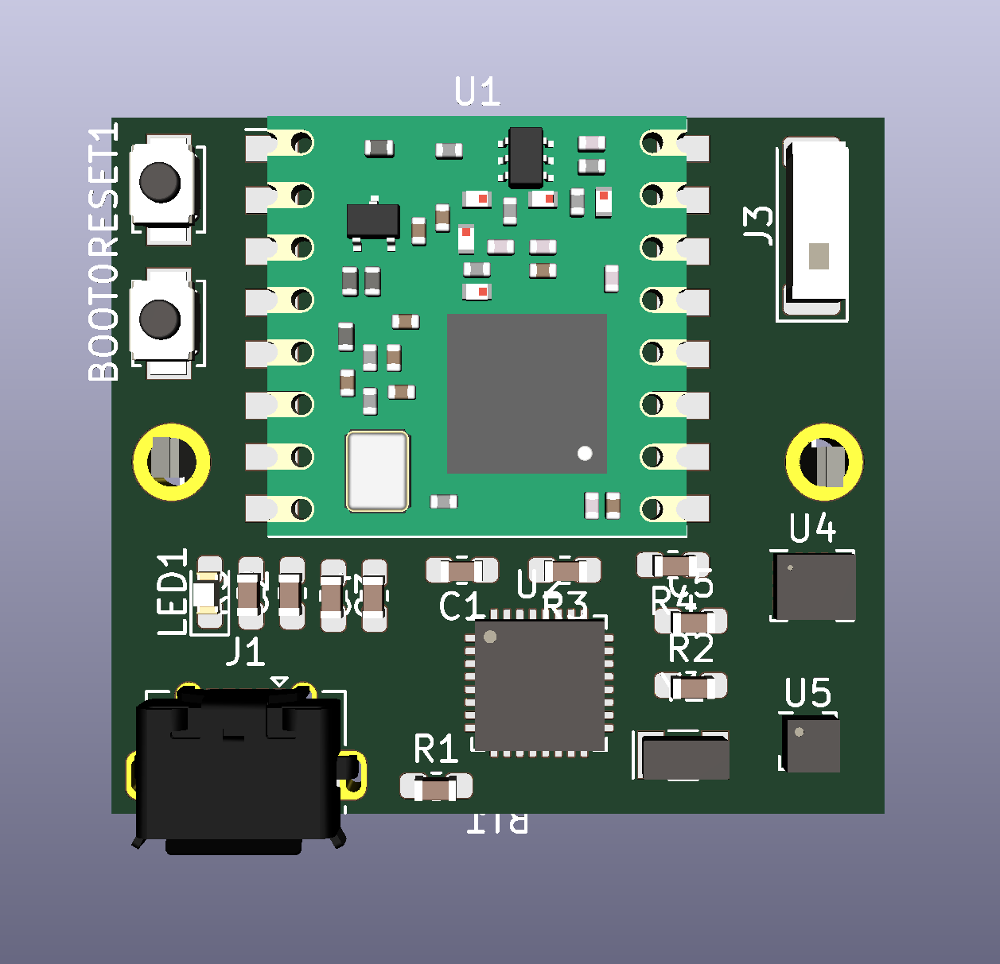
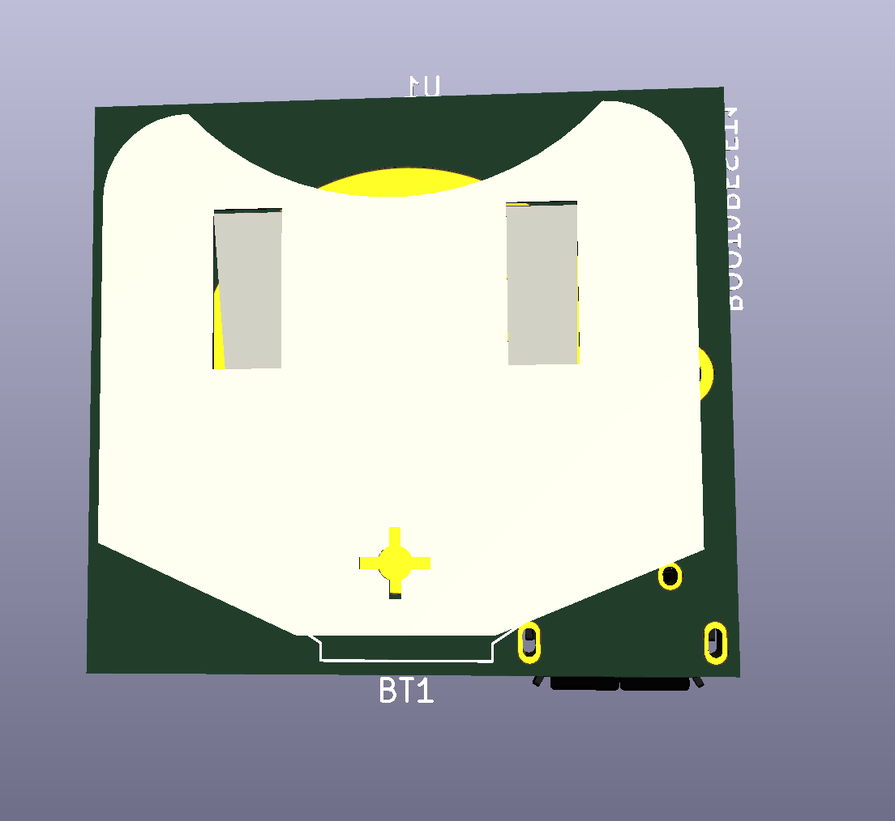
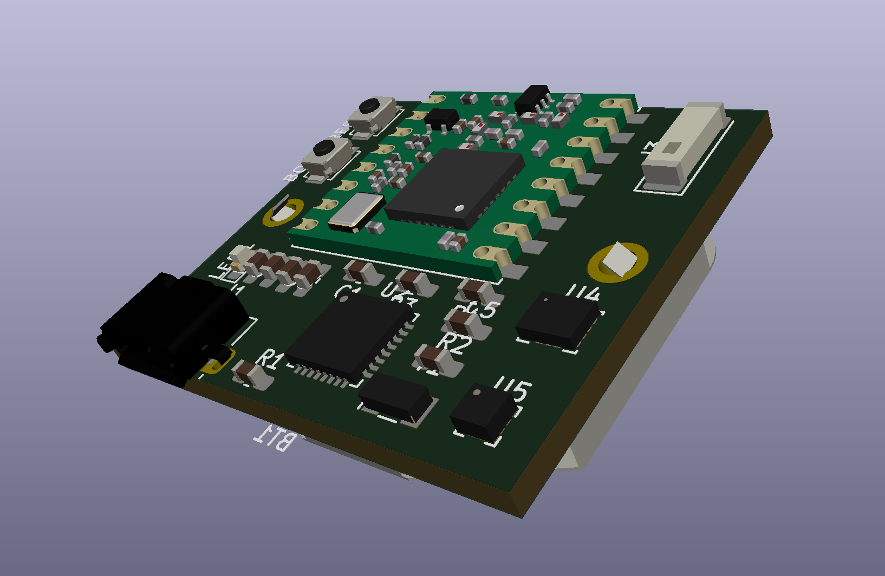
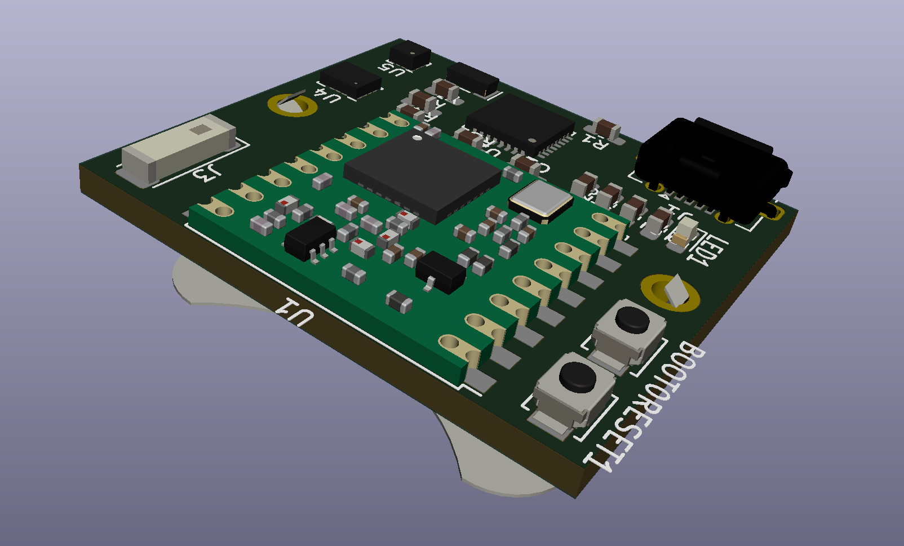

# AI-ccelero

Small battery powered circuit with accelerometer and LoRaWAN for AI projects.

* 27x30mm
* STM32L432KC
* LSM6DSM (Accelerometer + gyroscope)
* LSM303AGR (Magnetometer + Accelerometer)
* RFM95W (LoRaWAN)
* CR2450 Battery (540mAh)
* Chip antenna
* USB connector for DFU

## Example sketches

